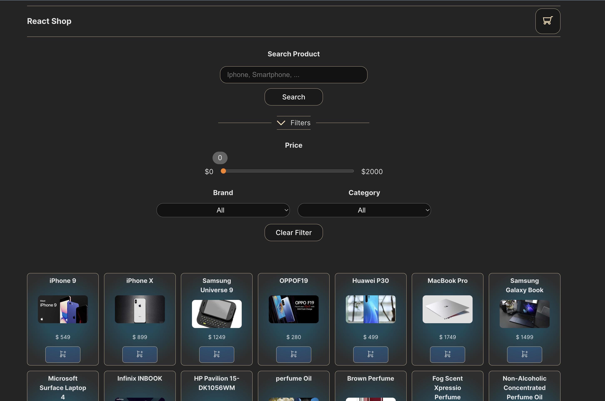
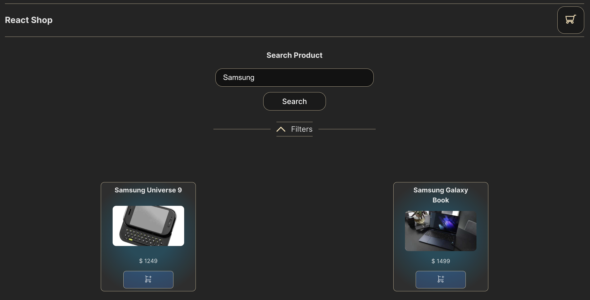
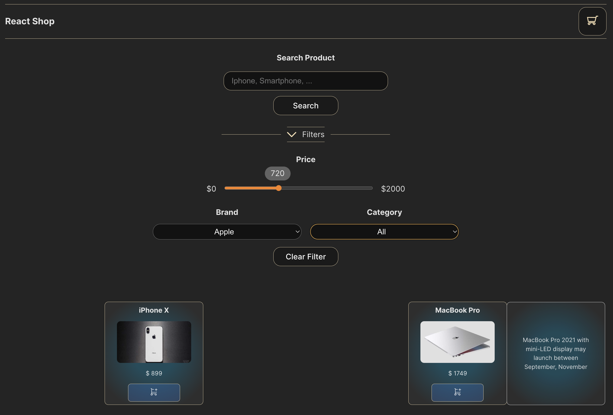
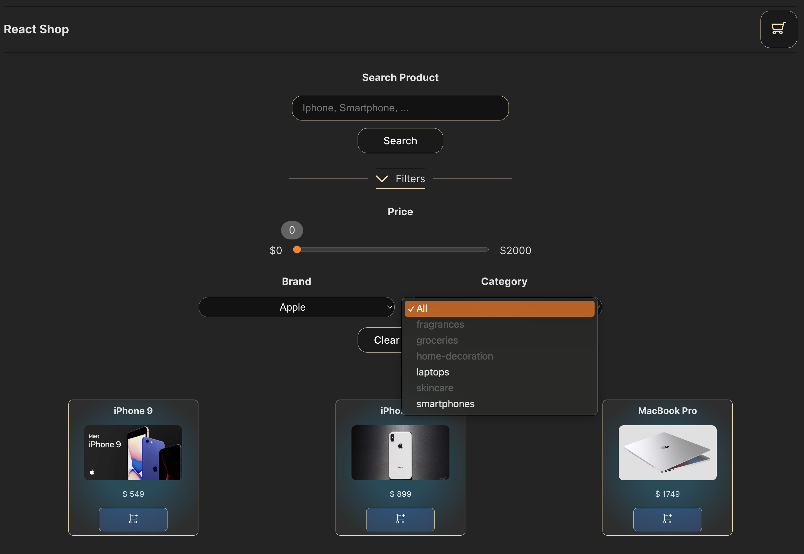
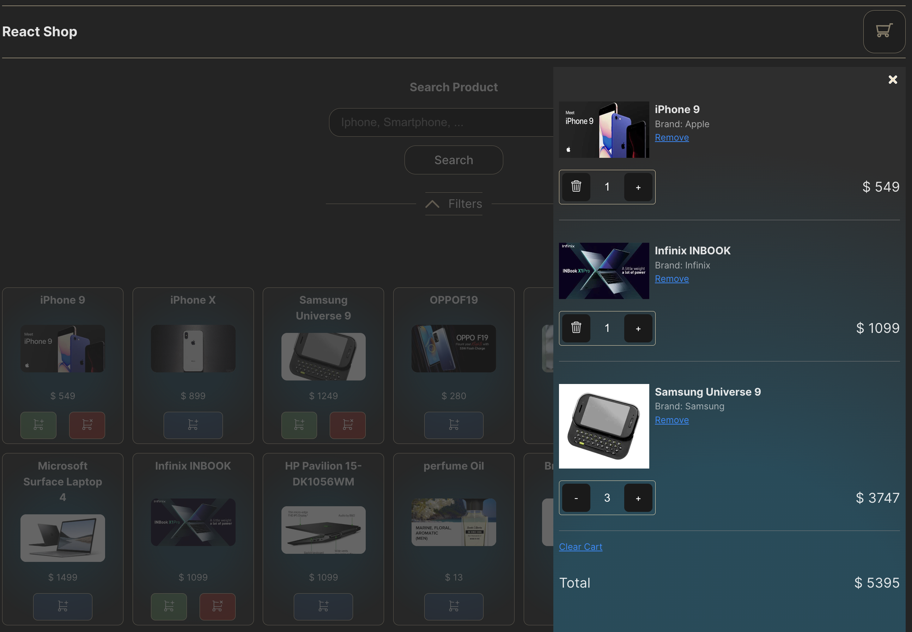

# E-commerce and Shopping Cart.

### 1. E-commerce:

- Show a list of products, API to obtain products (https://dummyjson.com/docs/products).
- When hovering items a description of the product is displayed.
- Add a filter per category, per brand, and per price. These filters should display possible available product when filtering, for example if we filter for the brand 'Apple' then the possible categories to select from will be 'smartphones' and 'laptops'.
- Search input to search desired products, whenever the input gets fully erased all products will show again.
- Button to show or hide filters.
- Button to clear filter.
- Created custom hooks to separate and share logic between components.
- Added loading skeletons when products are loading.
- When no products are founded display a msg.

### 2. Shopping Cart:

- Add products to cart.
- Delete/remove products from cart.
- Modify products amount in cart.
- Sync changes between cart and product list.
- Save in LocalStorage the cart, so changes persist in page re-loading.
- Whenever clicking outside cart section, it close the cart.

### General Considerations.

- Implemented Context for global state handling and prop passing.
- Implemented Reducer for consolidating state update logic.
